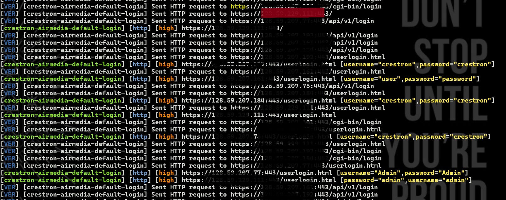

# nuclei
nuclei templet 
nuclei -l https_targets.txt -t crestron-airmedia-default-login.yaml -o results.txt -v

# Nuclei - Crestron AirMedia Security Testing

**Repository:** `https://github.com/Death112233/nuclei.git`

## 🎯 Simple Usage

### Basic Command
```bash
nuclei -l targets.txt -t crestron-airmedia-default-advanced-login.yaml -o results.txt
```

### Quick Start
1. **Add targets to `targets.txt`:**
```
https://target1.com
http://192.168.1.100
```

2. **Run scan:**
```bash
nuclei -l targets.txt -t crestron-airmedia-default-advanced-login.yaml -o results.txt -v
```

## 📁 Only What You Need
- `crestron-airmedia-default-advanced-login.yaml` - Main template
- `targets.txt` - Your target list
- `results.txt` - Scan results

## ⚠️ Legal Notice
Use only on systems you own or have permission to test.

---

*Clean and simple - ready to use!* 🔒
